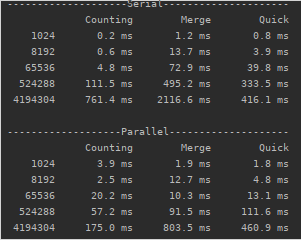

# Serial vs Parallel Algorithms

This project compares the serial versions of CountingSort, MergeSort and QuickSort to their parallel
versions and outputs the runtime results.

## Findings
CountingSort
* Arrays at smaller sizes performed better in the serial version
* Arrays at higher sizes performed significantly better in the parallel version

MergeSort
* Arrays at smaller sizes performed about the same in both versions
* Arrays at higher sizes performed significantly better in the parallel version

QuickSort
* Arrays at smaller sizes performed about the same in both versions
* Arrays at higher sizes performed better in the parallel version

